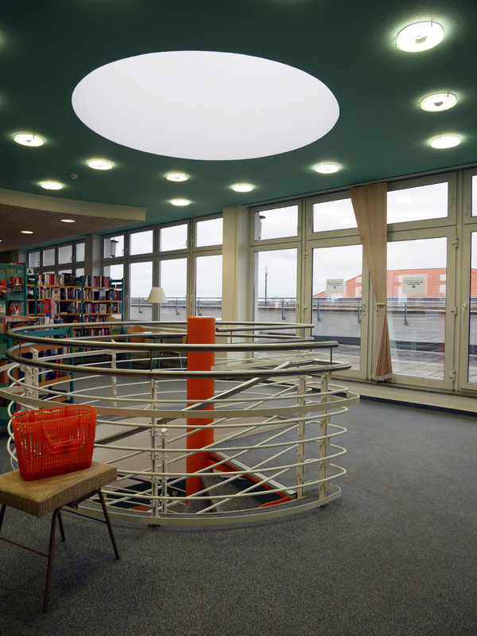
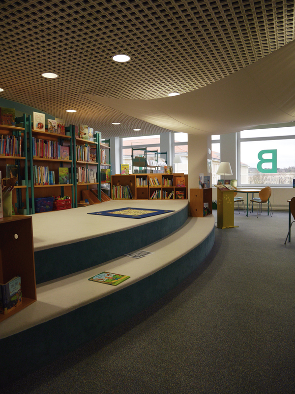
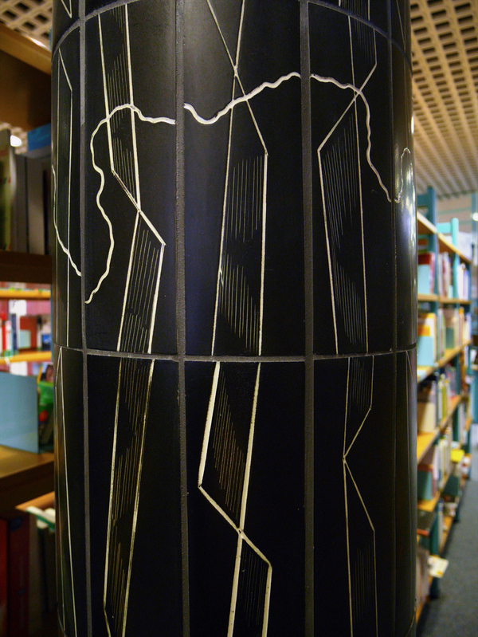
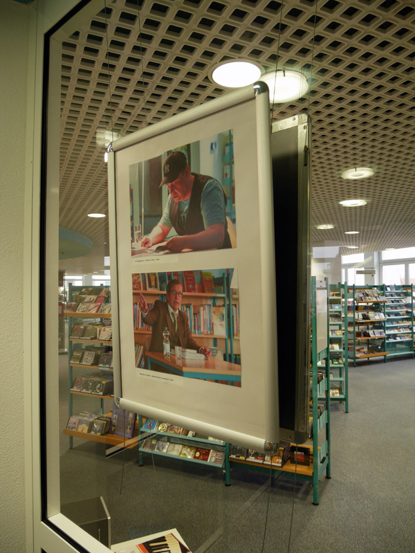
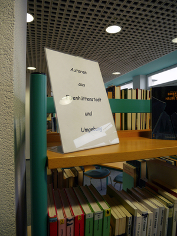
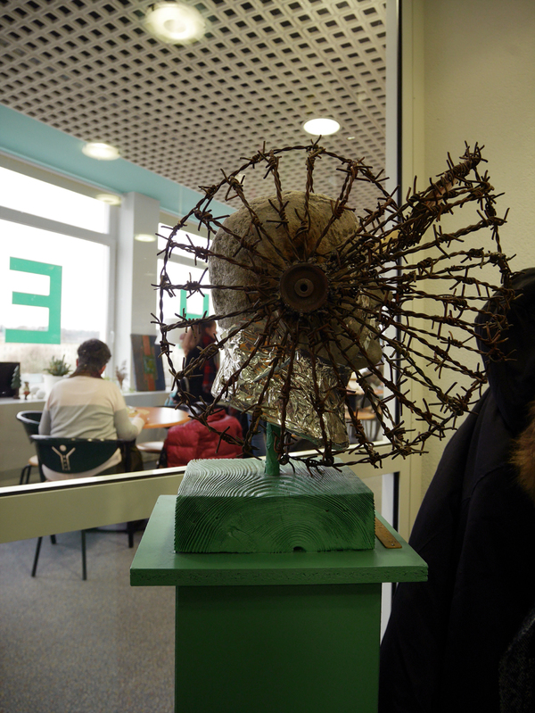

Die Planstadt Eisenhüttenstadt, ab 1950 als erste sozialistische Stadt
am Reißbrett entworfen und in den märkischen Sand gebaut, seit den
1990ern schrumpfend und zunehmend wieder aus dem märkischen Sand
entfernt, ist mir besonders verbunden. Denn sie ist die Stadt meiner
Kindheit und Jugend. Und damit auch der Ort meiner frühen Begegnungen
mit dem Phänomen Bibliothek.

Diese Aufeinandertreffen ergaben sich zugegeben weniger oft, als ich
gern aus der Rückschau berichten würde. Denn der Haushalt, in dem ich
aufwuchs, häufte traditionell mehr Bücher in sein Arbeits-, Wohn- und
Kinderzimmer und später auch Kellerräume, als man in einem Menschenleben
lesen können wird. Eine Traditionslinie, die sich bis heute fortsetzt.
Ein Vorteil war, dass sich zu viele Bücher im Haus bekanntlich
außerordentlich als Impftherapie gegen jede Art von Bibliotheksangst
eignen. Ein Kind mit Büchern überhäufen, nimmt frühzeitig die Illusion,
es ginge je um zielgerichtete Lektüren auf Vollständigkeit. Das
eigentliche Ziel einer Bibliothek ist nicht die Lektüre selbst. Sondern
es sind die vielfältigen möglichen Lektüren. Je mehr, je mannigfaltiger,
desto besser. Die Bibliothek symbolisiert Möglichkeit.

Der Bestand der Stadtbibliothek Eisenhüttenstadt ist, wie jeder
Bibliotheksbestand, eine Repräsentation solcher Möglichkeiten. Für die
Kommunalbürokratie ist er freilich zu groß. Diese fragt nämlich
bekanntlich nicht nach dem, was möglich ist, sondern nach dem, was ist.
Und was es kostet. Und sie geht oft davon aus, dass ein zu großer
Bestand auch zu viel kostet.

Auf dem Papier stimmt es ja auch: Die Stadtbibliothek Eisenhüttenstadt
besitzt im Vergleich zur Einwohnerzahl Eisenhüttenstadt zu viele Medien.
Wofür sich zwei Ursachen identifizieren lassen. So gab es eine
traditionell eine recht üppige Ausstattung als Erbe des sehr
aufgefächterten Bibliothekslands DDR, das denkbarerweise gerade in der
sozialistischen Vorzeigestadt Eisenhüttenstadt eben auch
bibliothekarisch hohe Standards erfüllen wollte. Dies gelang eher in den
vielen Zweigstellen als in der Zentralbibliothek. Diese fand nämlich
erst weit nach 1989 den Ort, an dem sie wirklich als Bibliothek und
nicht als Provisorium funktionieren konnte. Die Zweigstellen dagegen
verschwanden nach 1989 wie auch die Bestandslücken, die die DDR trotz
allem doch gelassen hatte.

Die zweite Ursache ist allerdings maßgeblicher. Noch als die
Zweigstellen verschwanden, bewohnten die Stadt im Vergleich zur
Gegenwart doppelt so viele Menschen. Heute sind es noch etwa 27.000,
Tendenz fallend und eingerechnet circa 1.500 Bewohner\*innen der
Erstaufnahmeeinrichtung für Asylbewerber\*innen, die sich am westlichen
und dank Abriss immer mehr entfernenden Stadtrand befindet. Dass neben
dem Eingang zur Bibliothek ein kleiner arabischer Lebensmittelladen
eröffnete, ist ein Zeichen, dass einige auch gekommen sind, um sogar in
Eisenhüttenstadt zu bleiben. Von außen gesehen wundert man sich seit je,
dass die Stadt keine offensivere Ansiedlungspolitik betreibt.

Betrachtet man aber die angespannte Lage der Stadt aus der
Innenperspektive, versteht man warum. Mehr noch als in anderen Gegenden
Ostdeutschlands ist die Fallhöhe vom auserwählten Ort (vor 1989) über
die Banalisierung, die üblichen 1990er-Jahre Erfahrungen des von
windigen Westimporten Über-den-Tisch-Gezogenwerdens, das einen großen
Teil der Kleinindustrie der Stahlstadt ruinierte, bis hin zur massiven
Abwanderung und dem breitflächigen Zertrümmern von Wohngebieten, die man
zum Teil selbst mit aufgebaut hat, enorm. Heute immerhin, so viel
Glimmer Hoffnung, hat der deutsche Film die Planstadtarchitektur als
Kulisse entdeckt und dreht hier Geschichten aus dem Kalten Krieg.

Abgesehen davon weist die Stimmung der Stadt an vielen Stellen
konsequent nicht in Richtung Aufbruch und Hoffnung, auch wenn das
Stahlwerk recht gut durch die Wenden kam und nach wie vor solide, teils
sogar auf einem Niveau deutlich über solide produziert. Auch eine große
Papierfabrik gibt es seit einigen Jahren. Aber Industrie verheißt heute
eben nicht mehr zwangsläufig einen großen Bedarf an Arbeitskräften. Und
wer sich außerhalb dieser zwei, drei Branchen beruflichen verwirklichen
möchte, hat so gut wie keine Wahl als abzuwandern, wenngleich es gar
nicht wenige Menschen in der Stadt gibt, die nach Berlin, Frankfurt/Oder
oder Cottbus pendeln. Es bleiben vor allem die Älteren. Diese sitzen in
einer der Kettenbäckereien, die das Stadtbild dominieren und vermissen
die Zeit, in der sie in der auch statistisch jüngsten Stadt Deutschlands
jung waren. Das mit den Filmen finden sie toll. Ein Silberstreif am
Horizont, vielleicht.

Dies sind also die Rahmenbedingungen, in der die Stadtbibliothek
operieren muss. Ihr Standort ist perfekt. Ein schöneres Objekt für die
Bibliothek, deren Hauptstelle in der DDR von Provisorium zu Provisorium
geschoben wurde, weil der seit Beginn der Stadtplanung angedachte
Kulturpalast auf dem Zentralen Platz nie realisiert wurde, lässt sich in
Eisenhüttenstadt nicht finden. Und vermutlich auch in anderen Städten
kaum. Sie belegt die oberen beiden Etagen des an der Haupteinkaufsstraße
gelegenen ehemaligen Textilkaufhauses.

Im obersten Stockwerk befand sich vor 1989 der so genannten Club der
Intelligenz, also ein Veranstaltungszentrum, das vermutlich regen
Gebrauch von der üppigen Dachterrasse machte, einem hervorragenden
Aussichtspunkt, um den gesamten Südwesten der Stadt zu überblicken. Geht
man um die Ecke, sieht man auch das im Norden gelegene Werk sowie die
der Bibliothek gegenüber liegende Ruine des Hotels "Lunik", ein
Glanzstück der Architektur der Ostmoderne, das in der
Nachwende-Privatisierungseuphorie einem vermeintlichen Investor aus
Bremerhaven de facto geschenkt wurde und seitdem verfällt. Ins ehemalige
Hotel Lunik wurde nie ein Cent investiert. Stattdessen ließ man es viel
zu lange auf und mittlerweile ist es durch Vandalismus so zugerichtet,
dass man sich kaum noch eine Rettung vorstellen kann. Für die Menschen
in Eisenhüttenstadt, das merkt man in jedem Gespräch, ist der Anblick
Tag für Tag ein Schlag ins Gesicht und die Botschaft, dass sie ihre
Stadt nicht retten werden können, wo die größeren Mächte des
Kapitalismus walten. Man sieht die zerschlagenen Fenster des einst
ersten Hauses am Platzes in voller Pracht aus der Kinderbibliothek. Will
man es positiv wenden, nimmt man es als Memento Mori. Das fällt leicht,
wenn man am Abend wieder zurück nach Berlin darf, ist am Ende aber
zynisch.

Die hochengagierten Mitarbeiterinnen der Bibliothek haben ohnehin andere
Probleme als die zerschlagenen Investitionshoffnungen vor ihren
Fenstern. Sie haben nun nämlich die Auflage, den Bestand analog zum
Rückgang der Bevölkerung auf ein vermeintlich ideales Verhältnis von
Kopf zu Buch zu kürzen. Die Bibliothek soll also wie die Stadt
schrumpfen und eventuell steht auch die Etage mit der Dachterasse zur
Disposition, ein Alleinstellungsmerkmal, das die Stadt aktuell nicht
einmal etwas kostet, weil der Vermieter des Hauses versteht, dass ein
Auszug der Bibliothek teurer ist, als ihr ein Geschoss quasi gratis zu
überlassen.

Warum die Stadtverwaltung also derart vehement darauf pocht, dass die
Zahl der Medieneinheiten reduziert werden, von aktuell 44.000 auf
35.000,[^1] ist nur für diejenigen nachvollziehbar, die Kennzahlen
fetischisieren. Die Nutzer\*innen der Bibliothek verstehen es jedenfalls
nicht, sondern freuen sich vielmehr über einige Vielfalt, die auch
darüber hinwegtröstet, dass dafür nicht jeder Bedarf an aktuellen Medien
komplett abdeckbar ist, was freilich ein chronisches Problem weiter
Strecken des öffentlichen Bibliothekswesens in Deutschland ist. Sie sind
dennoch glücklich und an einem Wochentag sieht man auch, wie wertvoll
die Bibliothek eben auch vielen als Ort ist. Sie freuen sich, dass hier
die Quellen in stiller, unaufdringlicher Atmosphäre in einer Weise
allgemein zugänglich gemacht werden, die es ihnen völlig ohne
zusätzliche Auflage ermöglicht, ihr Verfassungsrecht nach Artikel 5 Abs.
1 des deutschen Grundgesetzes wahrzunehmen. Sie nehmen klaglos hin, dass
die Inneneinrichtung seit Eröffnung der neuen Fläche aus Kostengründen
keine größeren Aktualisierungen erhalten konnte. Sie akzeptieren, dass
die Funktionalität der Bibliothekssoftware nicht mehr ganz den
Ansprüchen der Gegenwart entspricht und zum Beispiel eine
Ausleihverlängerung vom heimischen Rechner nicht möglich ist. Vielleicht
brauchen sie das auch gar nicht. Die Onleihe gibt es ja. Aber wichtiger:
Die Bibliothek existiert als Lese- und Kommunikationsraum. Man sollte
das gerade hier nicht unterschätzen, denn die Stadt bietet naturgemäß
nur eine überschaubare Menge an möglichen Orten der Begegnung. Und die
meisten davon sind die Filialen der Kettenbäckereien.

Um es eindeutig zu sagen: Die Bevölkerung mag und braucht ihre
Stadtbibliothek. Selbst wer sie nicht aktiv benutzt, hält sich daran
fest, dass gegenüber der Spekulationsruine, die so symbolisch für vieles
an diesem Ort ist, auf zwei Etagen über dem Zentrum an einem tristen
Montag im Winter ein Licht zu sehen ist und darauf verweist, dass dieses
Gemeinwesen einen öffentlichen Platz besitzt, an dem jede\*r willkommen
ist. Gerade für Menschen aus einkommenschwächeren Schichten, von denen
es in Eisenhüttenstadt nicht wenige gibt, steckt darin auch das Signal
eines unvoreingenommenen Zugangsversprechens. Wie sehr dies tatsächlich
eingelöst wird, steht auf einem anderen Blatt. Wie gesagt: Die
Bibliothek symbolisiert Möglichkeit. Das allein besitzt bereits für eine
Stadt und ihre Gesellschaft einen erheblichen Wert.

Das von der gegenüberliegenden Straßenseite in die Bibliothek
hineinleuchtende Rathaus sendet dahingehend allerdings mitunter
gemischte Signale. Der neue Bürgermeister hatte sich im Wahlkampf auf
die Themen Wirtschaftsförderung und Sport ausgerichtet, der aus seiner
Sicht im Vergleich zur Kultur zu wenig gefördert wird. Auf Nachfrage
immerhin sprach er sich immerhin für die Bibliothek aus:

> "Die Stadtbibliothek hat einen festen Platz in der Stadt und in der
> Finanzplanung. Das wird auch bei mir so bleiben. Dafür stehe ich; denn
> wir möchten ja, dass unsere Kinder viel lesen, sich somit bilden und
> damit uns alle voranbringen. Bücher gehören zum Grundsätzlichen, was
> eine Stadt ihren Bürgern bieten muss."[^2]

Das hört man gern, auch wenn man ergänzen sollte, dass das Phänomen des
lebenslangen Lernens auch an Eisenhüttenstadt nicht vorübergehen wird
und daher nicht nur Kindern der Griff zum bildenden Buch oder zur
weiterbildenden Zeitschrift ans Herz zu legen sei. Und man pflichtet
bei, auch wenn man weiß, dass sich die Rolle einer Bibliothek gerade
nicht in der Funktion einer zusätzlichen Bildungseinrichtung erschöpft,
sondern dass sie im besten Fall ein zentraler Integrationsfaktor einer
Stadtgesellschaft ist, vielleicht auch ein dritter Ort, wenn man zu
angesagten Bezeichnungen neigt, in jedem Fall ein öffentlicher Raum, der
nicht Konsum sondern das Bedürfnis nach Kommunikation, nach Lektüre,
nach dem Versprechen der Texte, Bilder und anderer Kulturspuren in den
Mittelpunkt rückt. Das kostet die Stadt und rentiert sich auf dem Papier
oft nicht. Aber der Wert einer solchen Institution lässt sich naturgemäß
niemals exakt bestimmen. Wie gesagt: Eine Bibliothek verkörpert nicht
Gewissheit, sondern Möglichkeit.

Ursprüngliches Ziel meines Ausflugs war, die fünf Fragen des
LIBREAS-Aufrufes abzuarbeiten. Aber jedes Gespräch steuerte automatisch
auf eine Sorge und einen Wunsch zurück. Die Menschen sorgen sich um die
Bibliothek. Sie wird als chronisch gefährdet angesehen. Entsprechend
wünscht man sich zunächst einmal, dass sie überhaupt dauerhaft erhalten
bleibt. Am besten an diesem perfekten Standort. Am liebsten auch in
dieser Größe. Man wünscht sich, dass die Öffnungszeiten im aktuellen
Umfang beibehalten werden können. Man möchte, dass der Bestand auf dem
aktuellen Niveau bleiben kann. Man wünscht sich natürlich auch und ganz
grundsätzlich, dass die Stadtverordneten und die Stadtverwaltung die
Bedeutung, die die Bibliothek für einen Großteil der Einwohner\*innen
von Eisenhüttenstadt hat, besser erkennen, die Bibliothek mehr
wertschätzen und sogar intensiver in die Stadtentwicklungsüberlegungen
einbeziehen. Man sieht die Bibliothek vom Rathaus und das Rathaus von
der Bibliothek. Eine Hauptstraße liegt dazwischen, aber es gibt eine
Fußgängerampel und auch sonst beeindruckend wenig Verkehr. Es sollte
also möglich sein, sich häufiger zu begegnen.

Die Mitarbeiterinnen wünschen sich nachvollziehbarerweise vor allem mehr
Planungssicherheit, um ihren Dienst für die Nutzer\*innen in Ruhe
leisten zu können. Man ist sehr zufrieden mit dem, was man hat. Wüsste
man, dass man diesen Stand und diesen Standort auch in fünf oder zehn
Jahren noch sicher hat, könnte man mit den vorhandenen Mitteln deutlich
zielgerichteter arbeiten, planen, Angebote für die Nutzer\*innen und die
Stadtbevölkerung schaffen. Die Menschen der Stadt sind ihre Möglichkeit.

Ungewöhnlich ist diese Bestandsaufnahme nach dem Ortstermin nun
keinesfalls. Vermutlich entsprechen die Wünsche ebenso dem, was viele
Öffentliche Bibliotheken beschäftigt. Für die Herausforderungen gilt
dies sicher leider ebenso. Diesbezüglich ist die Stadtbibliothek von
Eisenhüttenstadt eher ein Regel- als ein Sonderfall. Aber
selbstverständlich kann man so an die Sache nicht herangehen. Denn es
geht um einen konkreten Ort, um konkrete Menschen mit konkreten Sorgen
und Wünschen und um ein konkretes Gemeinwesen, in dem die Bibliothek
fest verankert ist. In diesem konkreten Szenario zeigt sich die
Stadtbibliothek zwar, wie jede Bibliothek der Welt, auf der Seite der
messbaren Zahlen als Kostenfaktor. Wichtig ist aber zu realisieren,
welchen Anteil das Haus für die Integration der Stadtgesellschaft, für
das kulturelle Leben in der Stadt, als Kommunikationsort, als Bildungs-
und Bindungschance besitzt und darüber hinaus auch als ein Baustein, der
den zwar schmalen aber doch spürbaren Strom des
Eisenhüttenstadt-Tourismus mitstützen könnte. Die Leseterasse bietet,
wie oben schon angedeutet, einen einzigartigen Überblick, der auch
deshalb so eine große Rolle spielt, weil das touristische Potential vor
allem an Stadtplanungs- und Architekturgeschichte Interessierte
ansprechen dürfte. Wenn diese Zielgruppe auf dem Weg zum Aussichtspunkt
ganz nebenbei mitbekommt, wie schön die Stadtbibliothek eigentlich ist,
dann dürfte das auch für das Stadtmarketing einen nicht unerheblichen
Nebeneffekt haben. Und wenn diese Besucher\*innen des Ortes auch noch
erfahren, dass sich in der Bibliothek eine herausragende Sammlung von
Materialien in einem sehr angenehmen Leseraum befinden, dann ist nicht
unwahrscheinlich, dass sich aus der Fotogelegenheit über den Dächern der
Stadt sogar ein spontaner, ganz klassischer Bibliotheksbesuch mit einem
Aufenthalt am Lesetisch ergibt. Und das ist natürlich nur ein Szenario.
Die Bibliothek ist für die Stadt nicht nur Bibliothek. Sondern in
vielerlei Hinsicht eine außerordentliche Möglichkeit.

(Berlin, Februar 2018)

### Erratum

Im Beitrag heißt es, dass die Stadtverwaltung auf einer Bestandsreduzierung besteht. Dies ist nicht korrekt. Richtig ist, dass sich ein von der Stadtverordnetenversammlung verabschiedetes Kulturstättenkonzept für eine Reduzierung des Bestandes ausspricht. (24. Mai 2018)

[^1]: <https://www.moz.de/artikel-ansicht/dg/0/1/1633265/>

[^2]: Vgl.
    <https://www.facebook.com/FrankBalzer2017/posts/853879258109366:0>
